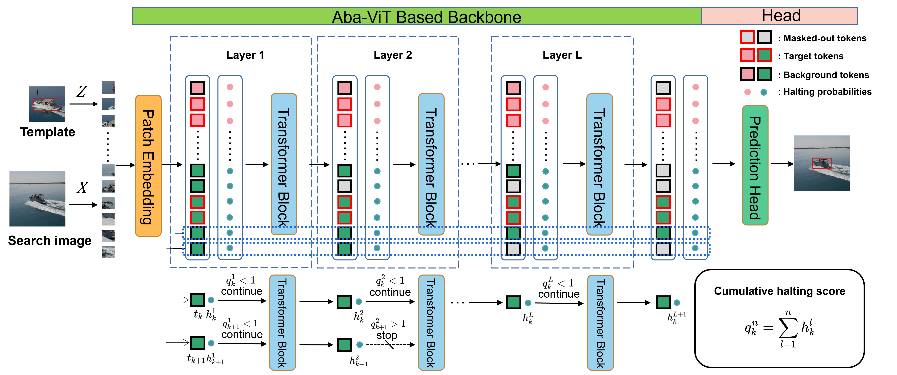

# Aba-ViTrack

The official implementation of the ICCV 2023 paper [Adaptive and Background-Aware Vision Transformer for Real-Time UAV Tracking](https://openaccess.thecvf.com/content/ICCV2023/papers/Li_Adaptive_and_Background-Aware_Vision_Transformer_for_Real-Time_UAV_Tracking_ICCV_2023_paper.pdf)

<p align="center">
  
</p>

## Install the environment
This code has been tested on Ubuntu 18.04, CUDA 10.2. Please install related libraries before running this code:
   ```
   conda create -n abavitrack python=3.8 
   conda activate abavitrack
   bash install.sh
   ```

## Model and raw results
The trained model and the raw tracking results are provided in the [Baidu Netdisk](https://pan.baidu.com/s/13aXfsihrbrh8WMu6XYTthA?pwd=nen9)(code: nen9) or [Google Drive](https://drive.google.com/drive/folders/17FYC5xl8EaBL21Zbhj7yQcU0lg9mblwx?usp=drive_link).

## Training
   ```
   # Training Aba-ViTrack
    python tracking/train.py --script abavitrack --config abavit_patch16_224  --save_dir ./output --mode single
   
   # Training Aba-ViTrack++
   # Place Aba-ViTrack's checkpoint into the 'teacher' directory.  
    python tracking/train.py --script abavitrack --config abavit_half_patch16_224  --csl 1 --script_teacher abavitrack --config_teacher abavit_patch16_224 --save_dir ./output --mode single
   ```

## Testing
   ```
    # Testing Aba-ViTrack
    python tracking/test.py abavitrack abavit_patch16_224 --dataset uav123 --threads 1 --num_gpus 1
    
    # Testing Aba-ViTrack++
    python tracking/test.py abavitrack abavit_half_patch16_224 --dataset uav123 --threads 1 --num_gpus 1

   ```

## Citation
```
@InProceedings{Li_2023_ICCV,
    author    = {Li, Shuiwang and Yang, Yangxiang and Zeng, Dan and Wang, Xucheng},
    title     = {Adaptive and Background-Aware Vision Transformer for Real-Time UAV Tracking},
    booktitle = {Proceedings of the IEEE/CVF International Conference on Computer Vision (ICCV)},
    month     = {October},
    year      = {2023},
    pages     = {13989-14000}
}
```
